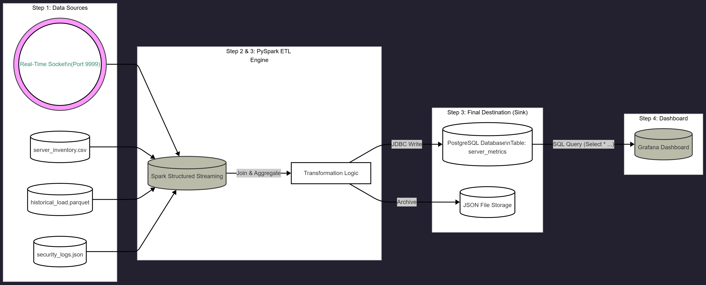

## Real-time-Server-Network-Monitoring-System.
This project is a Big Data ETL pipeline designed to monitor server network traffic and security logs in real-time. It simulates a college network environment, processes data using PySpark, and visualizes it on a Grafana dashboard.

# 🏗 Project Architecture
# The Pipeline Flow:

1. Generate: A Python script creates fake server logs (CSV, Parquet, JSON) and streams live network traffic (Socket).

2. Process: PySpark reads the static files and listens to the live stream. It joins the live traffic with server inventory data.

3. Store (Dual Sink):

    Hot Path: Aggregated data is sent to PostgreSQL for the dashboard.

    Cold Path: Raw data is saved to JSON files for archival/backup.

4. Visualize: Grafana connects to PostgreSQL to display real-time metrics.

